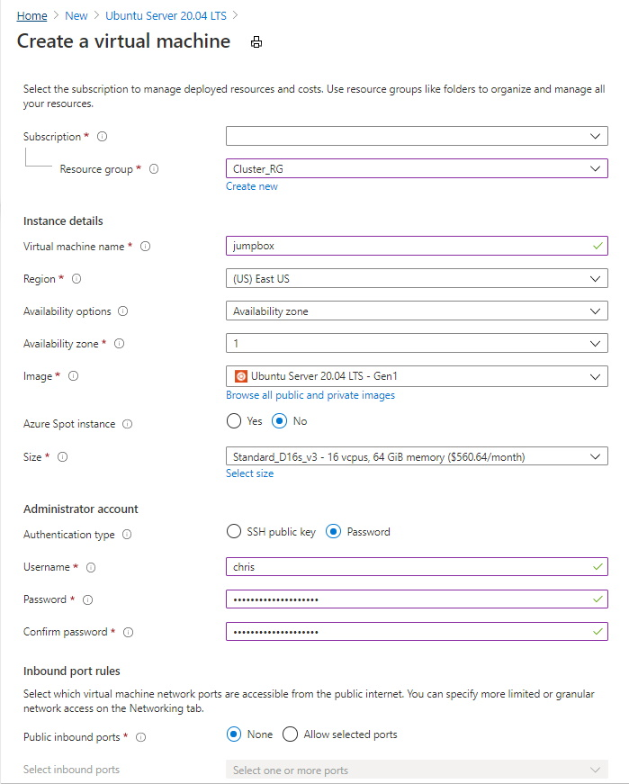

# PraxiCloud Samples Basic Cluster
PraxiCloud Libraries are a set of common utilities and tools for general software development that simplify common development efforts for software development. The samples repository is used to provide examples on how to use these libraries and tools, or perform common tasks as an easy point of reference. The basic cluster demonstrates how to configure the basic Azure Kubernetes Service cluster and related environment that is the basis of Kubernetes samples. Samples that are related to Kubernetes start from this configuration unless otherwise stated.


# The Resource Groups

Resource Groups are manually created to support the dependencies that do not "require their own", such as the Firewall service. The subnet used to contain the Azure Kubernetes Service cluster, which will be the core subnet, requires a substantial number of available IP Addresses beyond that of a class C subnet. For this reason the simple setup will be to use a class A address space (CIDR of 8) and the subnets will be class B (CIDR of 16). 

- **Core_RG** contains the Kubernetes cluster as it is the compute resources.
- **Network_RG** contains the network related resources.
- **PaaS_RG** contains the supporting Platform as a Service resources.


*Note: the resource groups blank lines above were removed as they are unrelated to the deployment.


# The Virtual Network

Create a virtual network layout for the deployment that represents a common implementation. The use of virtual networks not only provides a level of control and ability to isolate but also offers advantages around data exfiltration controls. For simplicity an A class address space will be used to support the larger IP range of subnets when doing CNI networking mode in later steps. While this is not required for production the sample makes it easier to handle bitmask definition and clarity of separation.

The basic network will include two subnets that are created ahead of time and a firewall network that will be created later by the configuration of the firewall. The service itself requires its own virtual network to operate properly.

- **Core** will be used to contain the cluster and potentially other compute related resources.
- **Support** will be used to host a jumpbox for accessing the various infrastructure components from behind the firewall.


The virtual network will use the Firewall service and assign it to a B class subnet. This has a far larger IP range than required but is being done for ease of demonstration and clarity. Finally create a new public IP address for the firewall.


Navigate to the Network_RG resource group and select the firewall to allow access from your public IP address to make it easier to interact with the samples. 


In the firewall resource in the "Rules" blade choose the "Network rule collection" tab.


Select "Add network rule collection" to add a rule named "Allow_remote_access" with a priority 100, Allow. Here the remote location's (e.g. your home) public IP address needs to be entered. There are many tools and options that can be found on the internet that help determine your public IP address. The rule will allow all protocols and destinations from that IP address. This is only for sample purposes and should be locked down as appropriate in production.

The IP Address has been removed from the image for security purposes.


# The Persisted Volume Storage Account

The Kubernetes cluster has the ability to expose persisted volumes through the use of an Azure File provider. The reason for the use of Azure Files in this scenario is to enable shared access across replicas such as Stateful Sets. This supports the mounting of the same persisted volume backing store to each replica.

Create a new Azure Storage Account in the PaaS_RG resource group that is in the same location as the cluster to be deployed.


Set the networking to use a private endpoint associated with the core subnet.


The details of the private link should be configured to use storage file shares as the storage sub-resource. The settings can be seen here.


# Azure Kubernetes Service

For the samples the configuration of Azure Kubernetes Service will locate it in the core subnet and Cluster_RG resource group and operate as Kubernetes 1.18.10 at this time. As appropriate this can be adjusted over time and indicated by the individual samples expectations. This will be composed of multiple node pools, the first for the system requirements, and the second named worker for load dispatching. Part of this separation is for general demonstration purposes and the other is to ensure the workloads do not impact cluster activities.

With the primary node pool being low load the default Standard DS2 v2 is acceptable with a node count of 3. This will be spread across the 3 availability zones.


Add the worker node pool to the cluster so it runs on all Availability Zones as a User pool. These will handle the core workload of the samples so they have an increased Virtual Machine size, scaled appropriately for the workload.


Once the worker node pool has been added it will look like this.


For cluster authentication System-assigned managed identity will be used with RBAC enabled.


The cluster networking will be setup to use Azure CNI and install on the core network. The Kubernetes service address ranges are not overlapping any subnets and the DNS should be in the service address range. Calico has been specifically selected for demonstration purposes in the future around network policies.


Create a new Azure Container Registry that is associated with the cluster so it can be used as the default without the need to add pull credentials. For the samples I have chosen to enable Admin user but in production it may be more appropriate to use a service principal. 


After creating the container registry the integrations should look as follows.


## Enable kubectl to access the cluster

Enabling remote access through the Kubernetes APIs. From the command line get the credentials and add it to the Kubectl context using the following commands. After the Azure CLI login command the you will be prompted to login.

```Azure CLI
az login
az account set --subscription {subscription name or id}
az aks get-credentials --resource-group {cluster resource group} --name {cluster name}
```

After the credentials are available test to see that the nodes can be retrieved with the following command.

```Kubernetes CLI
kubectl get nodes
```


## Configure the cluster and associated authentication

Install the dashboard and create the proper bindings to support the RBAC.

```Kubernetes CLI
kubectl apply -f https://raw.githubusercontent.com/kubernetes/dashboard/v2.0.0/aio/deploy/recommended.yaml
kubectl create serviceaccount dashboard -n default
kubectl create clusterrolebinding dashboard-admin -n default --clusterrole=cluster-admin --serviceaccount=default:dashboard
```

After setting up the bindings retrieve the token that can be used to log into the Kubernetes dashboard. This should be run from the PowerShell console.


```PowerShell
[System.Text.Encoding]::UTF8.GetString([System.Convert]::FromBase64String(((kubectl get secret (kubectl get serviceaccount dashboard -o jsonpath="{.secrets[0].name}") -o jsonpath="{.data.token}"))))
```

Copy the token and save it for logging into the dashboard in the sample.


## Configure Pod Identities

This portion of the configuration leverages a bash command line. This can be performed using the the Windows Subsystem for Linux, or a separate virtual machine.

```bash
# clone the repository and move to the root of the directory
git clone https://github.com/Azure/aad-pod-identity.git
cd aad-pod-identity

# set the cluster information into the bash and environment variables
resourceGroup={cluster resource group}
clusterName={cluster name}
subscriptionId={subscription id}
identityName={name of identity}

export SUBSCRIPTION_ID="$subscriptionId"
export RESOURCE_GROUP="$resourceGroup"
export CLUSTER_NAME="$clusterName"
export CLUSTER_LOCATION="{location}"

# execute the script to assign the roles
bash ./hack/role-assignment.sh

# Install the Pod Identities 
kubectl apply -f https://raw.githubusercontent.com/Azure/aad-pod-identity/v1.7.0/deploy/infra/deployment-rbac.yaml

# Wait up to 30 seconds before deploying to make sure the required roles etc. exist

# Indicate that MIC and NMI should bypass the interception
kubectl apply -f https://raw.githubusercontent.com/Azure/aad-pod-identity/master/deploy/infra/mic-exception.yaml

az identity create -g $resourceGroup -n $identityName
export IDENTITY_CLIENT_ID="$(az identity show -g $resourceGroup -n $identityName --query clientId -otsv)"
export IDENTITY_RESOURCE_ID="$(az identity show -g $resourceGroup -n $identityName --query id -otsv)"

# Assign role reader rights to the identity so it can access the resource group
export IDENTITY_ASSIGNMENT_ID="$(az role assignment create --role Reader --assignee ${IDENTITY_CLIENT_ID} --scope /subscriptions/$subscriptionId/resourceGroups/$resourceGroup --query id -otsv)"
```

# Setup the Jump Box

Setup an Ubuntu Server 20.04 LTS machine without any inbound port rules.



Place the  virtual machine on the support subnet without any NIC Network Security Group.

